# Japanese Practice — Flash Card Desktop Application

**日本語練習** · A local desktop application for learning Hiragana, Katakana and
Kanji: multiple-choice flash cards, memory-training boards, native Japanese
pronunciation, and analytics that show precisely which characters are failing.

Built by [Mensura Media](https://github.com/MensuraMedia) · Companion to the
[language-learning](https://github.com/MensuraMedia/language-learning) worksheet
collection.

> **Licence: personal use only.** Commercial use, modification and
> redistribution require prior written consent — see [LICENSE](LICENSE).
> **If you build a flash-card or language-learning app from this, attribution to
> Mensura Media is required** — see [NOTICE](NOTICE) for the exact text.

---

## What it is

A **native desktop application** — its own window, not a browser tab — that runs
entirely on your machine. No account, no network, no telemetry.

The study loop:

1. A card shows **one character and nothing else**
2. Three options appear beside it — one correct, two drawn from characters that
   are genuinely confusable with it
3. Choosing scores automatically and flips the card, so a wrong answer still
   teaches
4. Every answer is recorded, and the dashboard shows what you keep missing

Printed flash cards do not know what you keep getting wrong. This does.

---

## Screenshots

Real captures from the running desktop window at 1280×860. The study history in
them is **generated demo data**, not a recording of anyone studying — regenerate
it with `python tools/demo_data.py --db /tmp/demo.db` and every number below
reproduces.

### Dashboard

Your landing page and your diagnostic surface. Six headline figures, then one
shelf per script — each followed immediately by its own memory-training games,
so the drill and the game for what you are working on sit together.

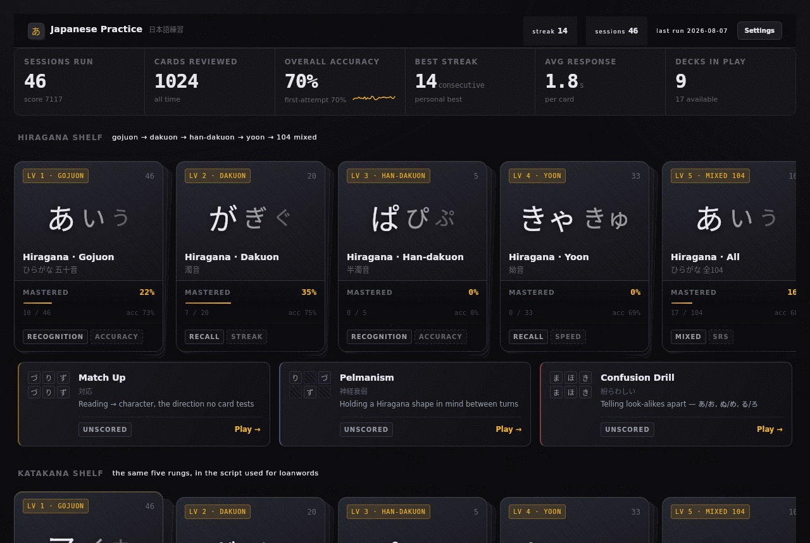

Kanji gets its own accent. Kana is a closed set of 104 sounds you finish; kanji
is 1,251 characters you chip at for years, and with the two stacked one above
the other the colour is what tells you which you are looking at.

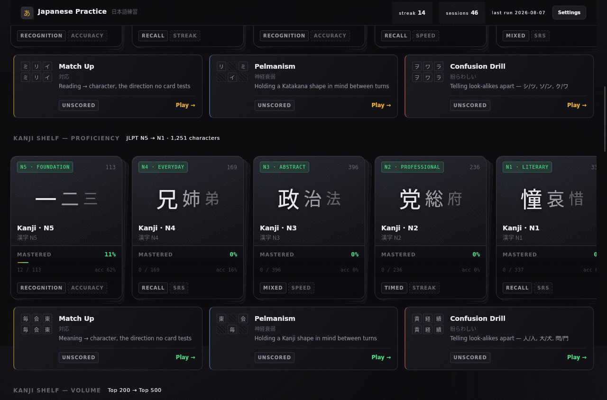

### Flash cards

A card shows **one character and nothing else**. Three options sit beside it.
Choosing scores automatically and flips the card, so a wrong answer still
teaches.

| Front — the glyph alone | Flipped — reading and audio |
|---|---|
| 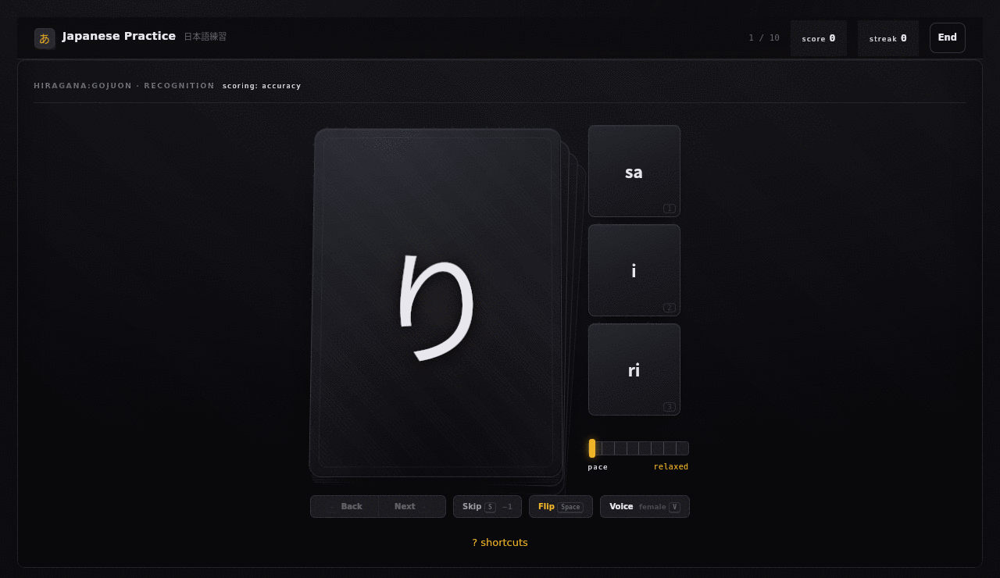 | 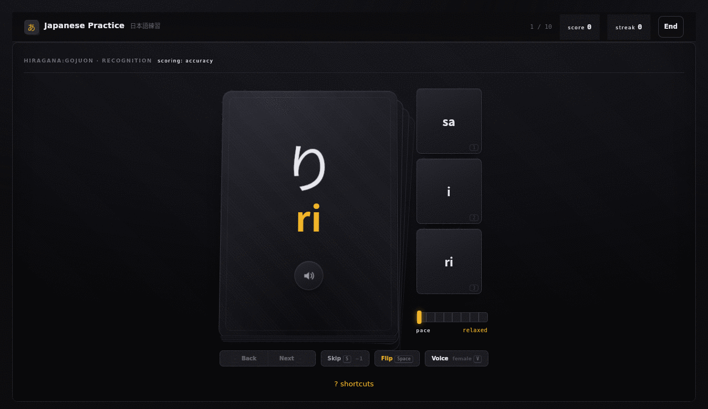 |

Kanji cards are graded on the **meaning**, so their options are English — which
would tell you nothing about how any of them sound. Each option therefore
carries the reading of the character it stands for, and the tiles are double
height to fit it.

| Kanji card — readings on every option | Flipped — on'yomi, kun'yomi, romaji |
|---|---|
| 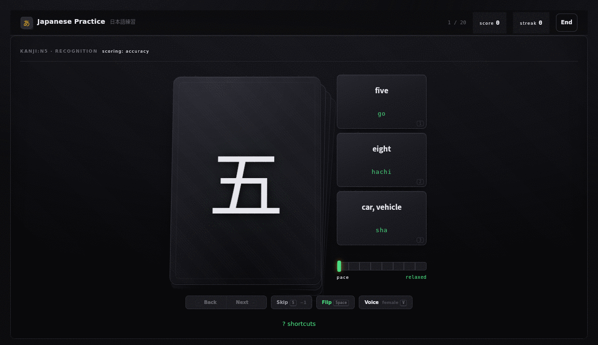 | 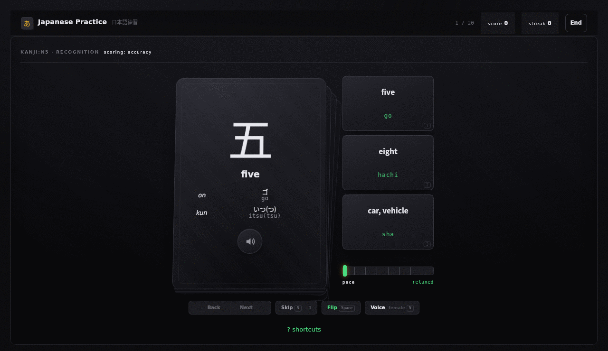 |

The pace slider under the options scales how long a verdict holds, from
*relaxed* to *relentless*. A learner who knows the deck should not be held at
beginner timing for twenty cards.

At the end, every character you saw — misses in red with the romaji beneath.
This run was answered at random to show the highlighting.

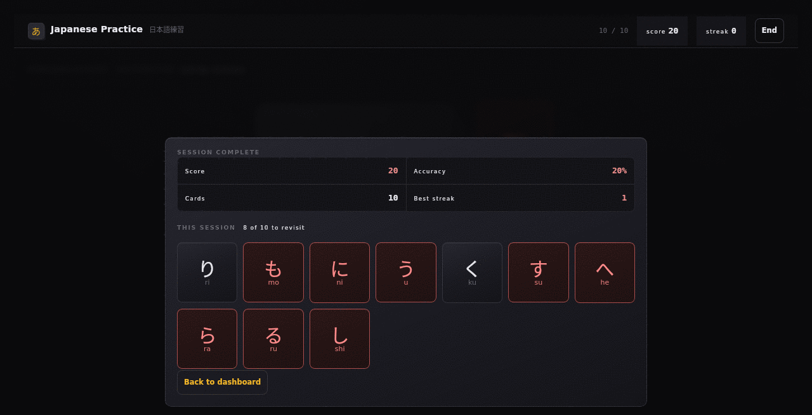

### Memory games

Nine unscored boards: Match Up, Pelmanism and Confusion Drill, each dealt in
each of the three scripts. Boards are built from **your weakest characters**.

The Confusion Drill below is stacked with kanji look-alikes, and both halves of
each pair are always dealt together — 白/百, 太/大, 績/積. A look-alike without
its partner is just an ordinary memory tile.

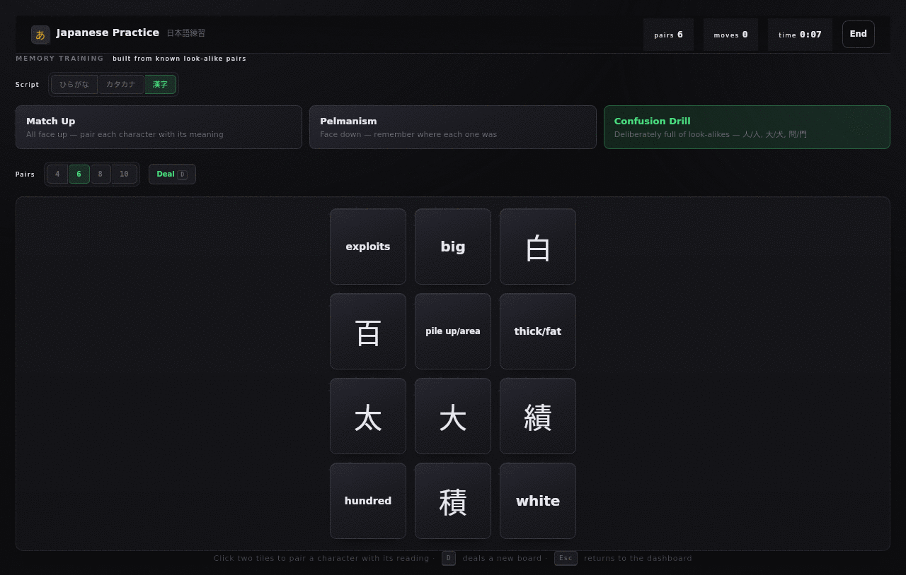

### Measurement

Printed flash cards do not know what you keep getting wrong. Every panel here is
derived at query time from an append-only attempts table, so a new metric
applies retroactively to all your history.

**Per-character miss rate.** A map of a *set*, not of your attempt log —
characters you have never seen appear dashed and empty, because that is the most
actionable thing the panel can tell you. The colour ramp tops out at 30%: above
that a character is simply failing, and below it is where the differences you can
act on live. Click any cell to drill it.

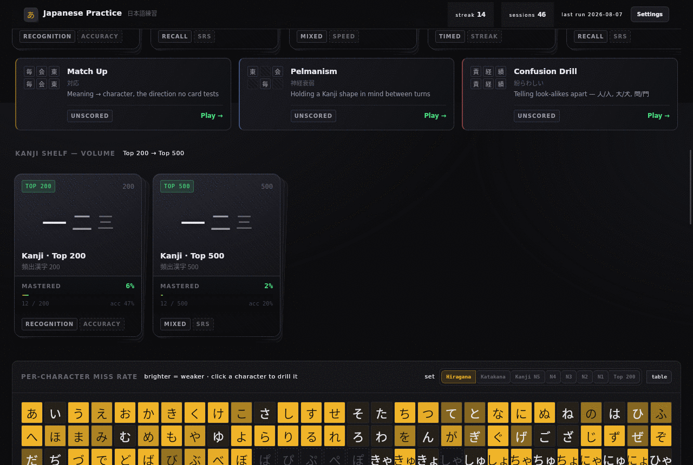

**Streak.** Consecutive days, a 28-day activity strip, and the last four weeks by
sessions, reps and mean accuracy. Streaks count distinct dates rather than
sessions — two sessions in one evening is one day of the habit.

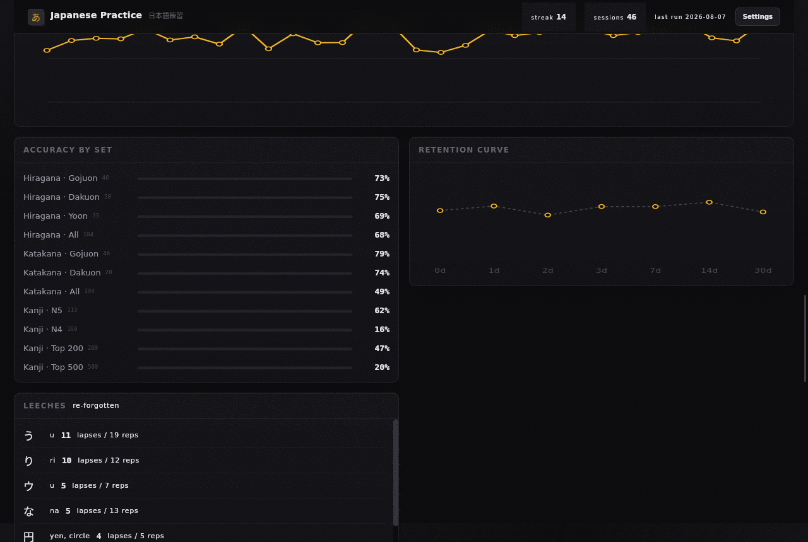

**Weak characters.** Recency-weighted, so a miss yesterday outranks one from
three months ago, and skips weigh more than wrong guesses — guessing wrong still
shows a partial trace, whereas passing means no recall at all.

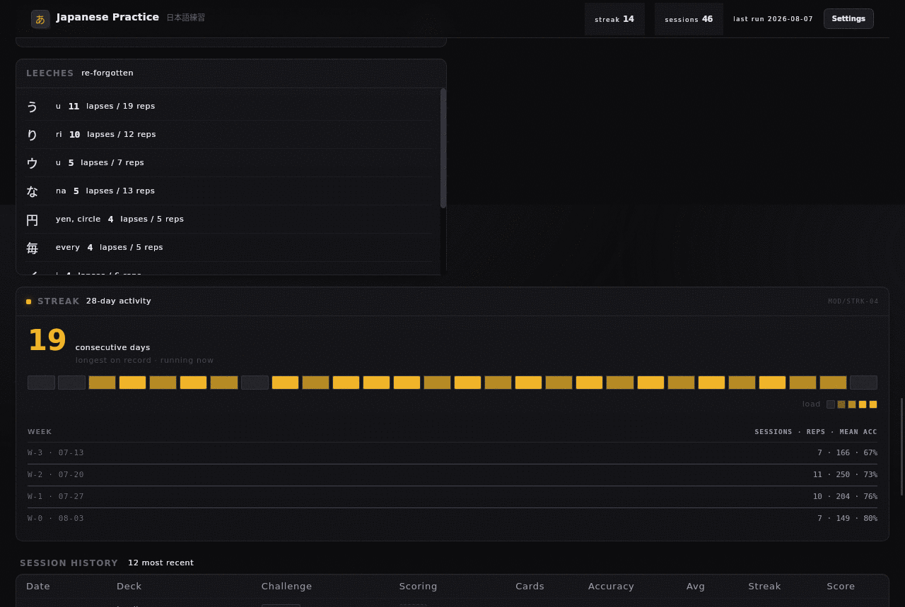

**Performance.** Accuracy per session, accuracy by deck, the retention curve
bucketed by days since a character was last seen, and leeches — the characters
you relearn and re-forget.

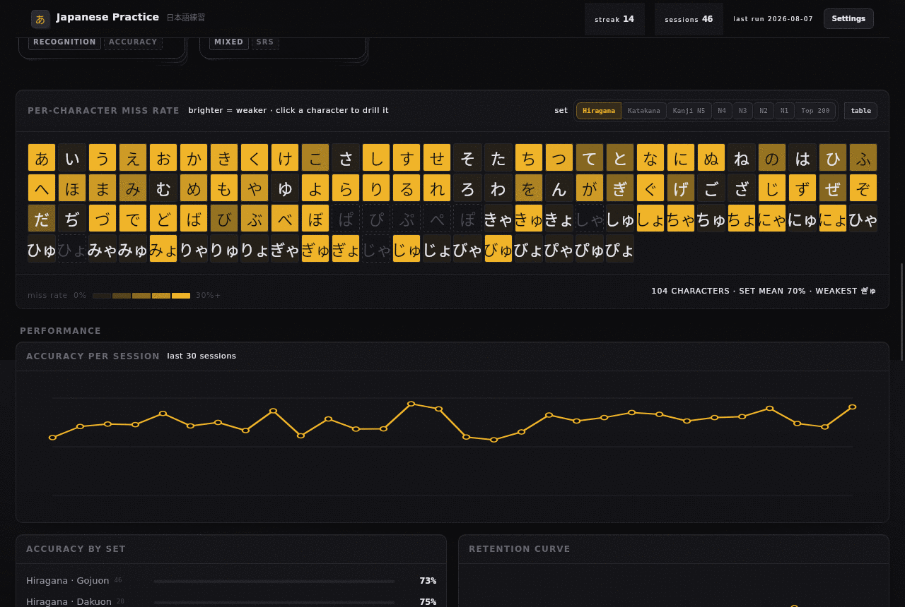

### Settings

Multiple learners on one machine, each with a **separate database file**. Save
your progress to a portable file keyed by character, load it back, or reset to
zero. A reset states exactly what it will remove and cannot fire unconfirmed.

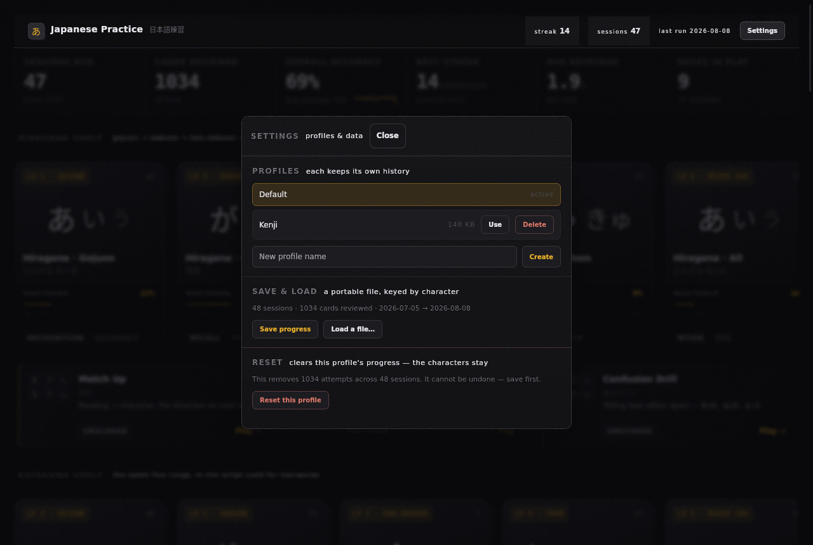

---

## Features

Full reference: **[docs/FEATURES.md](docs/FEATURES.md)**

| Area | Summary |
|---|---|
| **Study** | 3-option multiple choice, true 3D flip, skip, back/next navigation, adjustable pace, full keyboard control |
| **Memory games** | Match Up, Pelmanism, Confusion Drill — in all three scripts, unscored boards dealt from your weakest characters |
| **Audio** | 630 bundled clips in two voices, plus local Japanese-native VOICEVOX synthesis with editable pitch accent |
| **Sound cues** | A chime on every correct answer — seven to choose from, or off entirely |
| **Analytics** | Per-character miss-rate heatmap, weakest-character drill queue, retention curve, mastery by group, leeches, streak calendar, session history |
| **Content** | Hiragana 104 · Katakana 104 · Kanji 1,251 across JLPT N5–N1 plus Top 200/500 by frequency · 106 words — days, months, numbers, time, demonstratives and particles |
| **Scoring** | Four schemes: accuracy, speed, streak, SM-2 spaced repetition |
| **Profiles & data** | Multiple learners, each in its own database file; save progress to a portable file, load it back, or reset to zero |

---

## Status

Working and in daily use. **322 tests passing.**

| Component | State |
|---|---|
| Study cards, scoring, analytics | ✅ Complete |
| Memory games | ✅ Complete — 9 boards, 3 per script |
| Profiles, save / load, reset | ✅ Complete |
| Audio — bundled + VOICEVOX | ✅ Complete |
| Desktop window + browser mode | ✅ Complete |
| Kanji N4–N1 + frequency tiers | ✅ Complete — 1,251 characters, 17 decks |
| Audio for the new kanji | ❌ 1,144 characters synthesise live rather than playing a recorded clip |
| Typed-recall mode | ❌ Planned |
| Packaging (`.deb`, AppImage) | ❌ Planned |

Everything outstanding is tracked with acceptance criteria in
**[docs/ROADMAP.md](docs/ROADMAP.md)**.

---

## Getting started

### Requirements

- Linux, macOS or Windows · **Python 3.10+**
- A CJK font (`fonts-noto-cjk` on Debian/Ubuntu) for glyph rendering
- A WebKit runtime for the desktop window (`gir1.2-webkit2-4.0` on Debian/Ubuntu).
  Without it the app runs in browser mode instead — it does not fail.

### Install

```bash
git clone https://github.com/MensuraMedia/language-learning-flashcards.git
cd language-learning-flashcards

# --system-site-packages is required on Linux, or pywebview cannot find
# PyGObject and silently falls back to browser mode.
python3 -m venv --system-site-packages .venv
.venv/bin/pip install -e ".[dev]"
```

### Run

```bash
.venv/bin/python -m japanese_practice              # desktop window
.venv/bin/python -m japanese_practice --no-window  # browser mode
```

### Install as a desktop application (Linux)

To get it in your application menu rather than running it from a checkout:

```bash
./tools/install-desktop.sh
```

That builds a wheel, installs it into its own virtualenv under
`~/.local/opt/japanese-practice`, puts a `japanese-practice` launcher on your
`PATH`, and registers an icon and menu entry. Nothing is written outside `$HOME`
and no root is needed. The installed copy is **independent of the checkout** —
the wheel is installed non-editable, so moving or deleting the source afterwards
does not break it. Re-run the script to upgrade.

```bash
./tools/uninstall-desktop.sh            # removes the app, keeps your history
./tools/uninstall-desktop.sh --purge    # also deletes every profile and session
```

**Your study data lives in `~/.local/share/japanese-practice/` and neither
script touches it** unless you pass `--purge` and then type `DELETE` at the
prompt. Uninstalling an application should not throw away the practice you did
with it.

### Develop

```bash
.venv/bin/python -m pytest                  # 290 tests, ~5s
.venv/bin/python -m ruff check src/ tests/
.venv/bin/python -m black src/ tests/
```

### Optional — better pronunciation

The app ships 630 clips and works offline without any setup. For Japanese-native
synthesis with correct pitch accent, run a local
[VOICEVOX engine](https://github.com/VOICEVOX/voicevox_engine); the app detects
it automatically and falls through silently when it is absent. See
[docs/VOICEVOX-EVALUATION.md](docs/VOICEVOX-EVALUATION.md).

---

## Technology

Three runtime dependencies. **33 packages** in the entire closure, no build step,
no `node_modules`.

| Layer | Choice | Why not the alternative |
|---|---|---|
| Desktop shell | **pywebview** | Uses the OS WebView already present. Electron would ship a ~150 MB browser and a Node runtime for a UI of a few hundred KB. |
| Server | **Quart** (ASGI) | Flask's API with native `async`. Audio shells out to a subprocess and analytics runs multi-table SQL — both would block a WSGI worker. |
| Persistence | **SQLite** via `aiosqlite` | Single-user, local. Zero configuration, one file to back up. The analytics are genuinely relational. |
| Frontend | Server-rendered templates + vanilla ES modules | No bundler, no framework. The source that ships is the source that runs — which is what makes the same UI open unchanged in a browser. |
| Charts | Inline SVG built in JS | A charting library would be the largest dependency in the project and the only one needing a CDN or bundle step. |

Verified, not asserted — see
**[docs/STACK-VERIFICATION.md](docs/STACK-VERIFICATION.md)**: zero import cycles,
zero hard-coded platform paths, zero external network references in the shipped
frontend.

---

## Documentation

| Document | Contents |
|---|---|
| [FEATURES.md](docs/FEATURES.md) | Complete feature and function reference |
| [INTERFACE-SOUND.md](docs/INTERFACE-SOUND.md) | The correct-answer cue system, and the preference layer behind it |
| [RELEASE-NOTES.md](docs/RELEASE-NOTES.md) | What changed each cycle, why, and what it cost |
| [STACK-VERIFICATION.md](docs/STACK-VERIFICATION.md) | Stack, modularity and universality audit |
| [ARCHITECTURE.md](docs/ARCHITECTURE.md) | How the system works; supportability |
| [ROADMAP.md](docs/ROADMAP.md) | Everything outstanding, with QA criteria |
| [TESTING.md](docs/TESTING.md) | Test suite structure and coverage gaps |
| [AUDIO.md](docs/AUDIO.md) · [VOICE-LAB.md](docs/VOICE-LAB.md) · [VOICEVOX-EVALUATION.md](docs/VOICEVOX-EVALUATION.md) | The audio pipeline end to end |
| [HANDOFF.md](docs/HANDOFF.md) | Session-to-session continuity |
| [BUILD-SPEC.md](docs/BUILD-SPEC.md) | Implementation contract |

---

## Attribution

Pronunciation audio generated with **VOICEVOX** — the application displays the
required speaker credit, and it must not be removed. Bundled clips were
synthesised with ElevenLabs. Character data derives from the MensuraMedia
`language-learning` reference set.

## Licence

**Personal use only.** Copyright © 2026 Mensura Media (メンスラ・メディア).
All rights reserved.

You may download, run and study this software for your own private learning.
**Commercial use, modification, redistribution and derivative works require
prior express written consent.** See [LICENSE](LICENSE) for the full terms,
including Section 8 on third-party materials that carry their own conditions.

### Attribution

If you build a flash-card, spaced-repetition, character-drill, vocabulary or
other language-learning application derived from this project — **in any
language, framework or runtime** — or if you use its curated character data,
groupings, confusion pairs or frequency ordering, **Section 5 requires you to
credit Mensura Media** somewhere an ordinary user of your app can find it.

[NOTICE](NOTICE) has the exact text to copy and where it goes.

Rewriting the code in another language does not remove the obligation.
Attribution alone does not grant permission — a derivative application still
needs consent under Section 4.

This does **not** apply to something you built independently. No claim is made
over spaced repetition, over multiple-choice drilling, over the kana or kanji
themselves, or over the JLPT levels — only over this expression of them and this
compilation of that data. Nothing here restricts discussing, reviewing,
benchmarking or teaching about the project.

This is a source-available, non-commercial licence. It is **not** an OSI
open-source licence.
